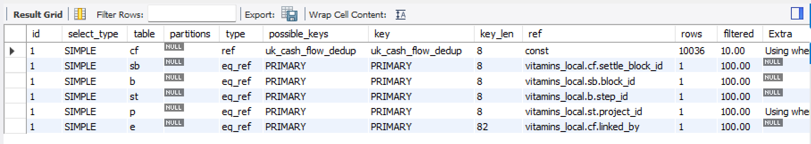
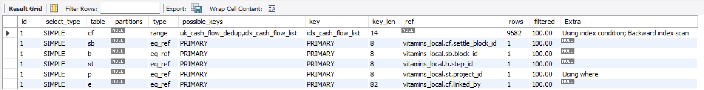

# 📔 모듈 6: 정산·재무 데이터 정합성과 동시성 제어, 성능 최적화 회고

---

## 1. 개요 및 핵심 요약

### 🎯 모듈 6 개요

모듈 6에서는 **텍스트·체크리스트·이미지 세 도메인의 동시 수정 방어**를 먼저 다진 뒤, 그 위에서 **정산·재무 도메인(CSV 업로드, 중복 검증, 세금계산서·입출금 매칭)의 데이터 정합성과 동시성 문제**를 정면으로 다뤘습니다. 마지막으로 실측 데이터를 바탕으로 인덱스·조인·N+1 구조를 손보는 **성능 최적화**까지 마무리했습니다.

### 📜 핵심 성과 및 개선 요약

* **CSV 양식 다양성 흡수**: 은행마다 다른 입출금 CSV 양식을 **단일/다중 표기 2축**으로 추상화해 4가지 유형에 대응하고, 세금계산서는 매입/매출 자동 구분 로직을 만들었습니다.
* **중복 검증의 함정을 실제 사고로 발견**: 제 명의의 자동이체 2건이 중복으로 오판되는 걸 직접 겪고, 이를 계기로 **4단계에 걸쳐 검증 기준을 확장**해 최종 7개 컬럼 조합으로 정합성을 확보했습니다.
* **동시성 설계를 상황별로 다르게 적용**: 같은 재무 영역인 세금계산서·입출금 매칭인데도, 상태 전이 여부에 따라 **한쪽은 조건부 UPDATE, 한쪽은 비관적 락(FOR UPDATE)**을 각각 선택했습니다.
* **실측 기반 성능 최적화**: EXPLAIN 결과를 근거로 복합 인덱스·CTE·배치 처리를 도입해 filesort·풀스캔·N+1을 제거했습니다.

---

## 2. 해결 과정 및 설계 의도 (Solution & Design)

### 2-1. 입출금 CSV 업로드 — 은행별 양식 추상화

* **AS-IS**: 신한은행·카카오뱅크 등 은행마다 CSV 컬럼 구성이 달라, 은행별로 파싱 로직을 따로 만들면 은행이 늘어날 때마다 코드가 늘어나는 구조였습니다.
* **TO-BE**: 실제 표기 방식을 뜯어보면 두 가지 축의 조합이라는 걸 발견해 추상화했습니다.

| 축 | 방식 A | 방식 B |
| --- | --- | --- |
| 금액 | 금액 + 구분(입금/출금) 컬럼 — 카카오뱅크 | 입금액 + 출금액 컬럼(음수로 표기) — 신한은행 |
| 일시 | 거래일시 하나로 통합 — 카카오뱅크 | 거래일자 + 거래시간 분리 — 신한은행 |

두 축을 조합하면 4가지 유형이 나오는데, 이 조합만으로 두 은행의 형식을 모두 커버할 수 있었습니다. 컬럼명은 키워드 기반으로 추천하고, 최종 매핑 확정은 사용자가 하도록 해 앞으로 다른 은행 양식이 추가돼도 이 2축 안에서 대응할 수 있게 했습니다.

세금계산서는 컬럼 구성이 매입/매출 모두 동일한데, 공급자용·공급받는자용으로 상호명·대표자명·주소 등 컬럼명이 겹치는 문제가 있었습니다. 사업자 번호로 매입/매출을 구분하려 했으나 둘 다 값이 채워져 있어 판별이 안 됐고, 대신 **CSV 상단에 적힌 "매입계산서/매출계산서" 문구**로 구분하기로 했습니다. 겹치는 컬럼은 매입/매출 여부에 따라 공급자용이 앞 순서·공급받는자용이 뒤 순서라는 규칙을 활용해, 같은 컬럼명 뒤에 `(2)`를 붙여 사용자가 구분할 수 있게 했습니다.

---

### 2-2. 중복 검증의 함정 — 4단계에 걸친 확장

**핵심 에피소드**: 제 명의로 서로 다른 통장에서 발생한 자동이체 2건이, 일시·금액·은행명이 완전히 같다는 이유로 하나가 중복으로 걸러졌습니다. 실제로는 다른 거래라고 확신할 수 있었던 지점은 **거래 후 잔액**이 서로 달랐다는 것이었습니다.

| 단계 | 검증 기준 | 문제 |
| --- | --- | --- |
| 1차 | `company_id`, `bank_name`, `traded_at`, `amount` | 잔액만 다른 서로 다른 거래를 중복으로 오판 |
| 2차 | 1차 + `balance_after` | `type`(입금/출금)이 빠져 같은 시각·같은 절댓값의 입금/출금이 동일 취급됨 |
| 3차 | 2차 + `type`, 잔액 NULL→`-1` 치환(`balance_after_key`) | 잔액이 없어 `-1`로 치환된 값이, **실제 잔액이 -1원인 정상 거래**(마이너스통장 등)와 충돌 |
| 4차(최종) | 3차 + `balance_after_present`(잔액 존재 여부 플래그) | `-1` 치환과 실제 `-1`을 구분해 두 문제 모두 해결 |

최종적으로 `company_id / bank_name / type / traded_at / amount / balance_after_present / balance_after_key` 7개 컬럼 조합으로 유니크 제약을 걸어, 잔액이 있는 은행과 없는 은행 모두를 안전하게 검증할 수 있었습니다.

> ⚠️ **남는 한계**: 직접 등록(수동 입력)은 잔액을 입력받지 않습니다. 잔액 없이 등록하는 게 정책이라, 직접 등록끼리는 잔액을 제외한 나머지가 전부 같으면 중복으로 취급됩니다. 파일 업로드보다 자유롭게 수정 가능한 직접 등록의 특성을 고려해, 감수할 만한 트레이드오프로 판단했습니다.

---

### 2-3. 동시성 제어 — 도메인마다 다른 이유로 다른 해법

같은 "동시 수정 방어"라는 목적이어도, 실제로 무엇이 경합 지점인지에 따라 구현을 다르게 선택했습니다.

| 도메인 | 방식 | 왜 그 방식인가 |
| --- | --- | --- |
| 텍스트 본문 | `WHERE deleted_at IS NULL` 조건부 UPDATE | 수정과 삭제가 각자 다른 컬럼을 건드리게 분리하면, 조건 하나로 "삭제된 걸 다시 살리는" 사고를 막을 수 있음 |
| 체크리스트 항목 생성 | `PESSIMISTIC_WRITE` 락 조회(`findActiveForUpdate`) | 블록 존재 확인(SELECT)과 항목 생성(INSERT) 사이의 틈에 그 블록이 삭제되면, 확인만으로는 못 막음 |
| 이미지 항목 수정/삭제 | `version` 컬럼 기반 조건부 UPDATE(낙관락) | 목록을 통째로 주고받는 API라 매 항목마다 "요청 시점 값과 같은지" 검증하는 게 자연스러움 |
| 입출금 내역 매칭 | 정산 블록 `status` 조건부 UPDATE, 락 없음 | 매칭 성공 시 **반드시 상태가 바뀌므로**, 그 UPDATE 자체가 경합을 걸러주는 가드 역할을 함 |
| 세금계산서 매칭 | `SELECT ... FOR UPDATE` 행 잠금(비관락) | 이미 PARTIAL/COMPLETED인 블록에도 세금계산서가 또 붙을 수 있어 **상태 변화가 경합 지점이 되지 못함** — 다른 테이블(세금계산서)을 직접 조회해서 확인해야 해서 락이 필요 |

**세금계산서 쪽 FOR UPDATE 흐름**: 연결 요청이 들어오면 대상 정산 블록 아이디를 `FOR UPDATE`로 잠가 대기열에 세운 뒤, 세금계산서 테이블에서 그 블록 아이디로 이미 연결된 행이 있는지 조회합니다. 0건이면 연결을 허용하고, 1건이면 실패시킵니다.

> 💡 **왜 비관락인가, 정리하면**
> 1. 재무 도메인은 동시 수정 자체가 드물어 낙관락/비관락의 성능 차이가 체감되지 않습니다(비용 문제가 아님).
> 2. 애초에 "한 행을 여러 명이 고치는" 낙관락이 겨냥하는 전형적 충돌도 아닙니다.
> 3. 입출금은 매칭 시 블록 상태가 반드시 바뀌니 그 상태값 자체로 차단이 가능합니다.
> 4. 세금계산서는 블록이 이미 다른 걸 물고 있어도 상태가 그대로일 수 있어 이 방법이 안 통합니다.
> 5. 그래서 "이미 연결된 게 있나"를 세금계산서 테이블에서 직접 확인해야 하고, 그 확인~반영 사이 틈을 없애려면 행을 잠가 순서를 강제(큐잉)해야 합니다.

---

### 2-4. 성능 최적화 — 실측 기반 개선

**발견된 문제**

| 구분 | 문제 | 설명 |
| --- | --- | --- |
| 1 | 목록 조회용 복합 인덱스 없음 | "우리 회사 것만 + 날짜순 정렬"에 맞는 인덱스가 없어 매번 정렬 작업(`Using filesort`) 발생. 로컬 1만 건대 실측에서 확인 |
| 2 | `LIKE '%검색어%'` 앞와일드카드 | 검색어가 문자열 중간에도 있을 수 있어 인덱스로 못 찾고 전체 대조. 구조적 한계 — 인덱스로 해결 안 됨 |
| 3 | `DATE(traded_at)`처럼 컬럼을 함수로 감쌈 | 인덱스는 원본 값 기준인데 함수로 가공 후 비교하니 인덱스를 못 탐. 세금계산서는 이 문제가 없고 입출금만 있었음(가장 고치기 쉬운 것) |

**그 외 발견된 비효율**

1. 정산 3단 조인(`settlement_block → block → step`) 반복 — 이미 받아온 `projectId`를 두고도 3개 매퍼 + `SettlementStatusMapper`까지 총 4곳에서 매번 다시 조인
2. 이미지 조회(`ImageDetailMapper`)에서 첫 장 판정을 위해 이미지 행마다 상관 서브쿼리 2개씩 재실행
3. 이미지 모아보기/휴지통 페이지네이션 누락
4. 체크리스트 카운트 쿼리가 총건수·완료건수 2회 왕복
5. 이미지 영구 삭제가 이미지 장수만큼 루프로 단건 호출

**적용한 개선**: ① `DATE()` 제거 ② 복합 인덱스 마이그레이션 ③ 체크리스트 카운트 쿼리 통합 ④ 이미지 배치 처리 ⑤ 정산·이미지 조회 조인 수 축소(CTE, 비정규화)

| 항목 | 뭐가 줄었나 | 전 | 후 |
| --- | --- | --- | --- |
| 체크리스트 카운트 | DB 왕복 횟수 | 2번(총개수 + 완료개수 쿼리) | 1번 |
| 이미지 영구삭제 | DB 왕복 횟수 | N장이면 N번 | 1번(N장이든 항상 1번, 배치) |
| 정산 매칭 추천 | 쿼리 1개 안 조인 실행 횟수 | 조인 체인 3번 | 조인 체인 1번(CTE) |
| 정산 상세 조회 | 쿼리 1개 안 조인 실행 횟수 | 조인 체인 3번 | 조인 체인 2번 |
| 이미지 조회(썸네일) | 서브쿼리 재평가 횟수 | 이미지 행마다 상관 서브쿼리 2개씩 재실행 | `GROUP BY` 한 번으로 집계 후 조인 |
| cash_flow/tax_invoice 목록 | 실행 방식 | 풀스캔 + 별도 정렬(filesort) | 인덱스로 바로 정렬된 순서 읽음 |

> 💡 **CTE가 뭐냐면** — `WITH 이름 AS (...)`로 임시 결과에 이름을 붙여두고, 본문 쿼리에서 그 이름을 테이블처럼 재사용하는 문법입니다. 정산 매칭 추천 쿼리에서 프로젝트의 정산 블록 목록을 한 번 조인해 이름 붙여두고, 최대회차번호·추천총액을 그 이름에서 여러 번 꺼내 쓰는 식으로 조인을 3번에서 1번으로 줄였습니다.

**인덱스 적용 근거(EXPLAIN)** — `(company_id, deleted_at, traded_at)` 복합 인덱스 적용 전후 비교:

▲ 인덱스 적용 전 — `type: ALL`(풀스캔), `key: NULL`, `Extra: Using where; Using filesort`

▲ 인덱스 적용 후 — `type: range`, `key: idx_cash_flow_list`, `Extra: Using index condition; Backward index scan` (filesort 사라짐, `traded_at DESC` 정렬을 인덱스 역순 스캔으로 그대로 해결)

세금계산서(`tax_invoice`)는 별도로 EXPLAIN을 다시 뽑지는 않았지만, `idx_tax_invoice_list(company_id, deleted_at, issued_no)`를 동일한 컬럼 순서·동일한 이유로 추가했기 때문에 같은 맥락의 개선입니다.

> ⚠️ **솔직한 참고**: 로컬 테스트 데이터(2만 건대)에서는 쿼리 응답 시간 자체는 인덱스 적용 전후로 극적인 차이가 보이지 않았습니다(둘 다 수 ms 내). 이번 개선의 실질적 증거는 **실행 시간이 아니라 실행 계획**입니다 — 풀스캔+filesort가 인덱스 스캔으로 바뀐 것 자체가 데이터가 수만~수십만 건으로 늘어났을 때 성능 저하를 막는 선제 조치입니다.

**인덱스를 늘려도 되는지 스스로 점검한 기준**

| 인덱스의 대가 | 내용 |
| --- | --- |
| 쓰기 비용 증가 | 행 하나 넣을 때마다 그 테이블의 인덱스 전부 같이 갱신 |
| 저장 공간 | 인덱스도 디스크를 차지함 |
| 관리 부담 | 안 쓰는 인덱스가 쌓이면 나중에 헷갈림 |

재무 도메인은 CSV 일괄 업로드(가끔, 배치라 사람이 기다려도 되는 작업)나 수동 1건 등록(어차피 사람이 직접 입력)이 쓰기의 대부분이라 **"자주 쓰는 테이블"이 아니라 "가끔 쓰고 자주 읽는 테이블"**입니다. 반대로 목록 조회는 사람이 화면 앞에서 기다리는 실시간 요청이라 느리면 바로 체감됩니다. 이 비대칭을 근거로 인덱스 추가를 결정했습니다.

---

## 3. 트러블슈팅 (Troubleshooting)

<--! ### 3-1. 텍스트 — 동시 수정이 삭제를 되돌리는 버그 (Critical)

#### ❌ 본문 수정이 진행 중일 때 삭제되면, 삭제가 취소됨

* **현상**: 본문 수정(PATCH)이 진행되는 도중 다른 요청이 그 텍스트를 삭제하면, 수정 쪽이 "삭제되기 전에 읽어둔 옛 상태(`deletedAt=null`)"를 그대로 다시 저장해버려 방금 삭제된 행이 되살아났습니다.
* **원인**: `save()` 메서드 하나가 본문(`content`)과 삭제 여부(`deletedAt`)를 항상 함께 덮어쓰는 구조였습니다.
* **해결**:
  1. `save()`를 `updateContent()`(본문만)와 `markDeleted()`(삭제 표시만)로 분리
  2. `updateContent()`의 SQL 자체에 `WHERE deleted_at IS NULL` 조건을 걸어, "확인하고 → 쓰기" 두 단계 사이의 틈을 없앰(조건 불일치 시 0건 갱신 → 기존 404 코드 재사용)
  3. `@DynamicUpdate`를 추가해 바뀐 컬럼만 SQL에 실리는 이중 안전장치 확보
* **결과**: 수정과 삭제가 동시에 일어나도 서로의 영역을 건드리지 못합니다.
* **인사이트**: 이번에 처음 IntelliJ에 AI를 연동해 사용했는데, 기능은 눈으로 검증했지만 이런 기본적인 동시성 문제는 사람 눈으로 잡기 어려웠습니다. CodeRabbit 리뷰가 아니었으면 놓쳤을 문제입니다.

#### ❌ 삭제 이벤트 중복 처리 문제

* **현상**: `markDeleted()`가 "조회 → 값 변경 → 저장" 방식이라, 삭제 이벤트가 중복으로 두 번 오면 이미 삭제된 걸 또 처리해 활동 로그가 중복 발생할 수 있었고, 삭제가 동시에 겹치면 나중에 처리되는 쪽이 최초 삭제 시각을 자기 시각으로 덮어써버렸습니다.
* **해결**: `markDeleted()`를 `WHERE deleted_at IS NULL` 조건이 붙은 UPDATE 한 방으로 바꾸고 영향받은 행 수를 반환받도록 했습니다. 이미 삭제된 상태면 0건 갱신 → `false` 반환 → 호출부는 "중복 이벤트니 무시"하고 조용히 종료합니다.
* **결과**: 삭제 이벤트가 중복이거나 동시에 겹쳐도, 실제 삭제는 한 번만 반영되고 최초 삭제 시각도 보존됩니다. -->

---

<--! ### 3-2. 체크리스트 — CodeRabbit 리뷰로 드러난 죽은 코드와 검증 공백

#### ❌ 문서엔 있지만 실제로는 던지지 않는 에러 코드
`ChecklistErrorCode.UNAUTHORIZED`(CHK-004)를 실제로 던지는 코드가 없었습니다. 401은 항상 `GlobalExceptionHandler`가 전역으로 `AUTH_UNAUTHENTICATED`를 반환하는데, 문서·Swagger는 CHK-004라고 적어놨었습니다. `UNAUTHORIZED` enum을 제거하고 문서·Swagger를 실제 응답(`AUTH_UNAUTHENTICATED`, `AUTH_PASSWORD_RESET_REQUIRED`)에 맞췄습니다.

같은 패턴이 하나 더 있었습니다 — 문서상 500은 `CHK-004`(`INTERNAL_ERROR`)였지만, 실제 500은 전역 핸들러가 항상 `COMMON_INTERNAL_ERROR`로 응답했습니다. 마찬가지로 죽은 enum을 제거하고 코드 번호를 재정렬했습니다.

* **인사이트**: 이 팀에 새로 합류해 컨벤션을 맞추기 어려웠는데, CodeRabbit이 반복적으로 같은 패턴("문서에는 있는데 실제로 안 던지는 코드")을 잡아준 덕분에 팀 컨벤션에 맞게 정리할 수 있었습니다.

#### ❌ 항목 생성 시 레이스 컨디션
블록 활성 확인(SELECT)과 항목 INSERT 사이에 그 블록이 동시에 삭제되면, 삭제된 블록 아래 활성 항목이 생길 수 있었습니다. 블록 존재 확인을 `PESSIMISTIC_WRITE` 락 조회(`findActiveForUpdate`)로 바꿔, 같은 트랜잭션이 끝날 때까지 그 블록 행을 잠갔습니다.

#### ❌ 수정 요청의 빈 값 검증이 없었음
`{}`, `{"content":""}` 같은 빈/공백 바디가 그대로 통과했습니다. 1차로 `@AssertTrue` 검증을 추가했더니, 검증 실패 시 응답 코드가 전부 `COMMON_INVALID_REQUEST`(범용 폴백)로 나가는 걸 발견했습니다. `GlobalExceptionHandler` 주석을 확인해보니 이 코드는 "도메인이 자기 코드를 안 만들었을 때 떨어지는 폴백"일 뿐 진짜 계약 코드가 아니었습니다. 결국 `@Valid`/`@NotBlank`/`@AssertTrue`를 전부 제거하고 서비스 레이어에서 직접 검증해 도메인 코드(CHK-005, CHK-006)를 던지도록 바꿨습니다.

#### 판단해서 반영하지 않은 지적
CodeRabbit이 "삭제 시 `checklist_block.updatedAt`도 갱신해야 하지 않냐"고 지적했지만, 팀이 직접 정한 컨벤션("`updatedAt`은 실제 내용/상태 수정 때만")과 충돌하고 텍스트 도메인의 동일 로직도 같은 방식이라 반영하지 않고 일관성을 유지했습니다. -->

---

### 3-3. 이미지 — S3 프라이빗 버킷과 삭제 연쇄 검증

#### ❌ S3가 퍼블릭이 아니라 URL을 매번 갱신해야 함
버킷이 퍼블릭 액세스 차단이라 DB에는 이미지 URL이 아니라 **S3 저장 키**만 저장되고, 조회 시점에 1시간짜리 signed URL을 발급합니다. 그래서 프론트가 이미지를 캐싱하면 만료된 URL을 계속 들고 있게 되는 문제가 있었는데, "이전/다음" 버튼 방식으로 그때그때 새로 발급받게 해 해결했습니다.
* **인사이트**: S3에 올리면 바로 퍼블릭 URL을 받아 저장할 수 있는 줄 알았는데, 퍼블릭 차단이면 저장소 키만 저장한다는 걸 이번에 알게 됐습니다. ERD 컬럼명과 실제 저장값이 다르지만 큰 문제는 아니라고 판단해 그대로 뒀습니다.

#### ❌ 이미지 복구 시 상위 블록 삭제 여부를 못 검증함
블록이 삭제되면서 그 안의 이미지도 같이 삭제된 경우, 이미지만 복구하려 해도 권한 검증 어댑터가 "삭제되지 않은 블록"만 검증해줘서 상위 블록 삭제 여부를 알 방법이 없었습니다. 이미지 휴지통 조회가 `projectId`만 받아오는 구조라 이미 MyBatis로 조회를 뚫어둔 김에, 삭제된 블록의 `stepId`까지 MyBatis로 받아와 블록 담당자가 만들어둔 권한 검증 어댑터에 그대로 넣는 방식으로 처리했습니다. 이제 "상위 블록이 삭제되어 하위 항목을 복구할 수 없습니다."라는 명확한 메시지를 반환합니다.

---

### 3-4. 정산·재무 — CSV 다양성과 실제 데이터가 던진 함정

#### ❌ CSV 컬럼 인식 실패
은행마다 첫 행이 컬럼 헤더가 아닐 수 있어, 첫 행 대신 **모든 컬럼이 채워진 행**을 헤더로 판단하도록 바꿨습니다.

#### ❌ 비밀번호 걸린 엑셀 업로드 불가
비밀번호가 걸린 엑셀 파일은 업로드 자체가 안 됐는데, 비밀번호를 함께 입력받아 서버에서 잠금을 해제하도록 확장했습니다.

#### ❌ 세금계산서 매입/매출 구분이 안 됨
공급자·공급받는자 사업자 번호가 매입/매출 모두 채워져 있어 구분 기준이 될 수 없었습니다. (2-1절 참고 — CSV 상단 문구로 판단하도록 전환)

* **인사이트**: 세금계산서는 입출금처럼 입금·출금을 동시에 받을 수 있을 거라 생각했는데, 사업을 하시는 아버지께 여쭤보고 나서야 **세금계산서는 매입과 매출이 애초에 분리된 문서**라는 걸 알게 됐습니다.

---

### 3-5. AI 위임과 컨벤션 — 재무 도메인 JPA 미사용 발견

#### ❌ 재무 도메인의 간단한 조회조차 JPA를 안 쓰고 있었음
CodeRabbit 리뷰로 재무 도메인이 처음부터 JPA를 거의 안 쓰고 MyBatis로만 구성돼 있다는 걸 알게 됐습니다.

* **원인**: 개발 초반 Claude Code를 IntelliJ에 연동해 빠르게 기능을 붙이면서, "기능 검증은 내가 직접 하지만, 컨벤션 준수는 문서(`AGENTS.md`)에 이미 적어뒀으니 AI가 알아서 지킬 것"이라고 가정했는데 이 가정이 틀렸습니다. 규칙은 이미 문서에 있었지만 실제로 읽히지 않았을 뿐이었습니다.
* **판단**: 이미 기능 개발이 끝나 잘 동작하는 상태에서, 동시 수정 방어까지 MyBatis 기준으로 복잡하게 잡아놓은 걸 다시 JPA로 되짚기엔 비용이 컸습니다. 재무 API 대부분이 조회이고(수정·매칭 정도만 쓰기), 여러 테이블을 얽어서 조회해야 하는 특성상 MyBatis 자체가 완전히 틀린 선택은 아니라고 판단해 구조는 그대로 두기로 했습니다.
* **인사이트**: "기능이 맞는지"와 "구조가 컨벤션을 지키는지"는 서로 다른 확인 지점이라는 걸 배웠습니다. 기능은 눈으로 확인되지만 구조 이탈은 눈에 잘 안 보여서, 사람이 매번 확인하기보다는 자동으로 걸리는 지점(CodeRabbit의 path instructions 같은)에 그 책임을 두는 게 훨씬 실효성이 있습니다.

---

### 3-6. 도메인 간 협업 — 책임 분리와 활동 로그 수집 방식
빠른 속도로 개발해서 프로젝트 기획의 안정성을 잡는데 도움을 줬습니다.
빠른 개발을 위해 블록과 프로젝트를 먼저 연결하면서 몇 가지를 협의했습니다.

* **블록 생성/삭제/조회 책임**: 블록 생성은 프로젝트 담당자가 껍데기만 만들고, 세부 블록(텍스트·체크리스트·이미지·정산) 담당자가 만들어둔 메서드를 호출해 내부를 채웁니다. 세부 내용의 생성·수정·삭제는 각 블록 담당자 소관입니다. 블록 삭제는 원래 이벤트 발행/구독 구조로 하려 했으나, 이미 메서드가 만들어져 있어 프로젝트 담당자 판단 하에 직접 메서드 호출 방식으로 바꿨습니다. 반면 통합 블록 조회는 각 블록 도메인 컬럼이 어떻게 바뀔지 모르는 상태에서 타 도메인을 직접 참조하게 되는 구조라, 각 블록 담당자가 조회에 필요한 정보를 만들어 프로젝트 담당자의 메서드를 통해 노출하는 쪽으로 정리했습니다.
* **활동 로그 수집 단위**: "수정건 하나에 대해 모두 로그를 남겨달라"는 요청에, 텍스트는 점 하나만 고쳐도 수정으로 잡히는 도메인이라 일단 전부 받은 뒤 도메인 담당자가 후처리하기로 했고, 이미지는 하나의 수정 API 안에서 캡션·순서·삭제가 동시에 일어날 수 있어 **수정된 항목 한 건 한 건을 개별 이벤트로 나눠 발행**하도록 요청해 처리했습니다.

---

## 4. 결과 및 주요 성과 (Results)

| 구분 | 개선 전 (AS-IS) | 개선 후 (TO-BE) | 성과 및 효과 |
| :--- | :--- | :--- | :--- |
| **텍스트 동시 수정** | `save()` 하나가 본문·삭제여부를 항상 함께 덮어씀 | `updateContent`/`markDeleted` 분리 + `WHERE deleted_at IS NULL` 조건부 UPDATE | 수정 중 삭제되면 삭제가 되돌아가던 치명적 버그 근본 차단 |
| **체크리스트 생성 레이스** | 블록 활성 여부 단순 SELECT | `PESSIMISTIC_WRITE` 락 조회 | 삭제된 블록 아래 항목이 생기는 경합 제거 |
| **입출금 CSV 대응** | 은행별 개별 파싱 | 금액·일시 표기 2축 추상화(4유형) | 신한·카카오뱅크 형식 모두 대응, 신규 은행 확장 가능 |
| **중복 검증** | 일시·금액·은행명 3컬럼 | 최종 7컬럼(타입, 잔액 치환, 잔액 존재 여부 포함) | 자동이체 오판 사례 해결 |
| **재무 매칭 동시성** | 검증 없음(레이스 가능) | 입출금: 상태 조건부 UPDATE / 세금계산서: `FOR UPDATE` 락 | 내역-블록 1:1 연결 보장 |
| **목록 조회(cash_flow/tax_invoice)** | 풀스캔 + `Using filesort` | `(company_id, deleted_at, 정렬컬럼)` 복합 인덱스 | EXPLAIN상 filesort 제거, index scan으로 정렬 해결 |
| **정산 매칭 추천/상세조회** | 조인 체인 3회 반복 | CTE로 1~2회 | 같은 조인 결과를 재사용해 실행 횟수 축소 |
| **체크리스트 카운트** | 2회 왕복(총건수/완료건수) | 1회 왕복으로 통합 | DB 왕복 절반 감소 |
| **이미지 영구 삭제** | N장이면 N번 루프 호출 | 배치 1회 | 왕복 횟수가 이미지 수와 무관하게 항상 1회 |

---

## 5. 한계 및 향후 개선 과제 (Limitations & Next Steps)

* **직접 등록 입출금의 중복 검증 사각지대**: 직접 등록은 잔액을 입력받지 않아, 잔액을 제외한 나머지가 모두 같은 두 건은 중복으로 취급됩니다. 파일 업로드보다 수정 자유도를 우선한 의도된 트레이드오프로 남겨뒀습니다.
* **거래처 관계를 1:1로 가정한 설계**: 프로젝트 단위로 입금/출금 각각의 총 금액 동등성을 검증했는데, 이는 타입별로 거래 상대방(외주업체 등)이 하나라는 가정 위에 있었습니다. 실제로는 한 프로젝트에 같은 타입의 거래처가 여러 곳(N:M)일 수 있어, 다시 설계한다면 프로젝트 단위가 아니라 **거래처명 단위**로 총액을 추천·검증하는 방향을 검토하겠습니다.
* **`LIKE '%검색어%'` 구조적 한계**: 앞와일드카드 검색은 인덱스로 해결되지 않는 구조적 문제입니다. 현재는 검색 빈도가 낮을 것으로 판단해 우선순위를 낮췄습니다.
* **재무 도메인의 JPA 미사용**: 컨벤션상 JPA가 기본이지만, 재무 도메인은 초기 개발 단계의 판단 미스로 MyBatis 위주로 굳어졌습니다. 이미 동시성 방어까지 그 구조 위에 쌓여 있어 지금 되돌리는 비용이 커, 구조 변경 없이 유지하기로 했습니다.
* **일부 목록 페이지네이션 누락**: 이미지 모아보기·휴지통 등 일부 조회에 페이지네이션이 빠져 있습니다. 프론트와의 협의가 필요한 항목으로 남겨뒀습니다.
* **이미지 순번 컬럼에 인덱스 부재**: 순서가 자주 바뀌는 컬럼이라 인덱스를 걸면 갱신 비용이 커질 걸 우려해 보류했습니다. 이미지·블록 수가 늘어나면 재검토가 필요합니다.

---

## 💡 프로젝트 회고 및 소회

### AI 페어 프로그래밍에 대한 소회

이번 모듈에서 처음으로 IntelliJ에 Claude Code를 연동해 기능 개발 속도를 크게 끌어올렸지만, 동시에 그 한계도 명확히 겪었습니다. **기능은 제가 직접 테스트하고 눈으로 검증했지만, 코드 구조가 팀 컨벤션을 지키는지는 별개의 확인 지점**이라는 걸 이번에 깨달았습니다. 텍스트 도메인의 동시성 버그, 체크리스트의 죽은 에러 코드, 재무 도메인의 JPA 미사용 — 전부 기능적으로는 잘 돌아가고 있었지만 구조적으로는 문서화된 규칙을 벗어나 있었고, 그걸 잡아낸 건 사람의 눈이 아니라 CodeRabbit이라는 자동화된 게이트였습니다.

솔직히 어느 순간부터는 AI(Claude Code)가 만들고 AI(CodeRabbit)가 검증하는 루프에 제가 얼마나 기여하고 있는 건지 의문이 들 때도 있었습니다. 하지만 그 사이에서 제가 할 수 있는 역할은 **"왜 이 방식이어야 하는지"를 판단하는 것**이었습니다 — 세금계산서와 입출금의 동시성 처리를 다르게 설계한 이유, 재무 도메인 구조를 되돌리지 않기로 한 판단, 거래처 관계를 다시 설계한다면 어떤 방향으로 갈지에 대한 트레이드오프 — 이런 결정들은 결국 도메인을 이해하고 있는 사람이 내려야 하는 몫이었습니다.

### 코드 밖에서 채운 도메인 지식

세금계산서의 매입/매출 구분을 사업자이신 아버지께 여쭤보고서야 "세금계산서는 애초에 매입과 매출이 분리된 문서"라는 걸 알게 됐고, 제 명의의 자동이체 2건이 중복으로 오판되는 걸 직접 겪으면서 잔액이라는 검증 기준의 필요성을 체감했습니다. 도메인 지식은 코드만 들여다봐서는 채워지지 않는다는 걸 이번 모듈에서 여러 번 느꼈습니다.

---

## 🔗 관련 저장소

* [Vit_S-GroupwareService-BackEnd (GitHub)](https://github.com/wanted-VitS-Project/Vit_S-GroupwareService-BackEnd)
* 정산·재무 핵심 도메인: `com.group3.vitamins.finance`, `com.group3.vitamins.settlement` 패키지
* 텍스트/체크리스트/이미지 도메인: `com.group3.vitamins.text`, `com.group3.vitamins.checklist`, `com.group3.vitamins.image` 패키지

> ⚠️ 위 EXPLAIN 스크린샷 2장은 자리만 잡아뒀습니다(`./images/m6-explain-before.png`, `./images/m6-explain-after.png`) — 실제 캡처 파일을 같은 경로에 넣고 파일명을 맞추거나, 블로그 저장소의 이미지 경로 컨벤션(`raw.githubusercontent.com/...`)에 맞게 경로를 바꿔주세요.
